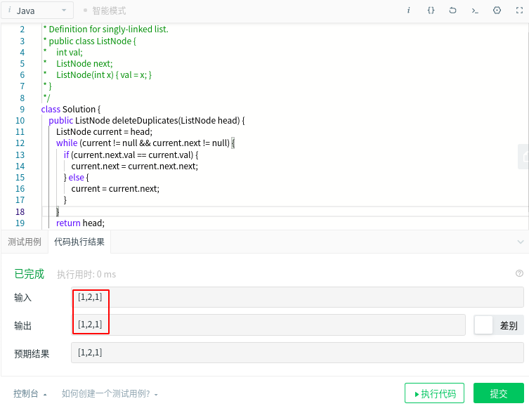

### 描述

给定一个排序链表，删除所有重复的元素，使得每个元素只出现一次。

示例 1:

> 输入: 1->1->2
> 输出: 1->2

示例 2:

> 输入: 1->1->2->3->3
> 输出: 1->2->3

### 解法

由于输入的列表已排序，因此我们可以通过将结点的值与它之后的结点进行比较来确定它是否为重复结点。如果它是重复的，我们更改当前结点的 next 指针，以便它跳过下一个结点并直接指向下一个结点之后的结点。

```java
class Solution {
    public ListNode deleteDuplicates(ListNode head) {
        ListNode current = head;
        while (current != null && current.next != null) {
            if (current.next.val == current.val) {
                current.next = current.next.next;
            } else {
                current = current.next;
            }
        }
        return head;
    }
}
```

注意这道题可以变种，将输入变成无序的数组，这时上面的解法将无效。以输入 {1,2,1} 为例，因为 1 后面是 2，直接将 current 指向 2 了，下次再比较的就是 2 和 它后面的 1，两个 1 根本没有联系起来。

<div align="center" ></img></div>
如果你看过《程序员面试金典》，将会发现里面正好有这道题，那么怎么解呢？其实思路跟上面差不多，只是增加了一个指针 runner，每次都直接从 current 走到表尾，找出并删除与 current 存值相同的节点，显然这种做法的时间复杂度也变成了 O(n<sup>2</sup>)。

```java
class Solution {
    public ListNode deleteDuplicates(ListNode head) {
        if (head == null) {
            return null;
        }
        ListNode current = head;
        while (current != null) {
            ListNode runner = current;
            while (runner.next != null) {
                if (runner.next.val == current.val) {
                    runner.next = runner.next.next;
                } else {
                    runner = runner.next;
                }
            }
            current = current.next;
        }
        return head;
    }
}
```

当然还有一种解法，不管链表是否有序，都可在遍历的同时使用 HashSet 将元素存进去，当遍历到某个元素时判断 HashSet 中是否存在已存在，是则将之删除（需要记录前继指针）。

```java
class Solution {
    public ListNode deleteDuplicates(ListNode head) {
        HashSet<Integer> set = new HashSet<>();
        ListNode prev = null, temp = head;
        while (temp != null) {
            if (set.contains(temp.val)) {
                prev.next = temp.next;
            } else {
                set.add(temp.val);
                prev = temp;
            }
            temp = temp.next;
        }
        return head;
    }
}
```

