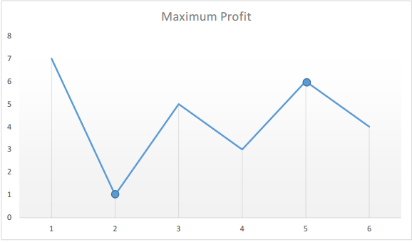

### 信息

- 难度：简单
- 标签：动态规划
- 公司：字节跳动

### 描述

给定一个数组，它的第 i 个元素是一支给定股票第 i 天的价格。

如果你最多只允许完成一笔交易（即买入和卖出一支股票），设计一个算法来计算你所能获取的最大利润。

注意你不能在买入股票前卖出股票。

示例 1:

```
输入: [7,1,5,3,6,4]
输出: 5
解释: 在第 2 天（股票价格 = 1）的时候买入，在第 5 天（股票价格 = 6）的时候卖出，最大利润 = 6-1 = 5 。
注意利润不能是 7-1 = 6, 因为卖出价格需要大于买入价格。
```

示例 2:

```
输入: [7,6,4,3,1]
输出: 0
解释: 在这种情况下, 没有交易完成, 所以最大利润为 0。
```

### 解法

#### 1. 暴力法

由于涉及到买入卖出时股票价值这两个值而已，所以可以直接双层遍历拿到每种组合的利益，输出最大利益即可。

时间复杂度：O(n<sup>2</sup>)，空间复杂度：O(1)

```java
class Solution {
    public int maxProfit(int[] prices) {
        if (prices == null || prices.length == 0) {
            return 0;
        }
        int maxProfit = 0;
        for (int i = 0; i < prices.length; i++) {
            for (int j = i+1; j < prices.length; j++) {
                int profit = prices[j] - prices[i];
                if (profit > maxProfit) {
                    maxProfit = profit;
                }
            }
        }
        return maxProfit;
    }
}
```

#### 2. 一次遍历

假设给定的数组为：[7, 1, 5, 3, 6, 4]，如果我们在图表上绘制给定数组中的数字，将会得到：

<div align="center" ></img></div>

使我们感兴趣的点是上图中的峰和谷。我们需要找到最小的谷之后的最大的峰。为此可以维持两个变量——minprice 和 maxprofit，它们分别对应迄今为止所得到的最小的谷值和最大的利润（卖出价格与最低价格之间的最大差值）。

```java
class Solution {
    public int maxProfit(int[] prices) {
        int maxProfit = 0, minPrice = Integer.MAX_VALUE;
        for (int price : prices) {
            if (price < minPrice) {
                minPrice = price;
            } else if (price - minPrice > maxProfit) {
                maxProfit = price - minPrice;
            }
        }
        return maxProfit;
    }
}
```

